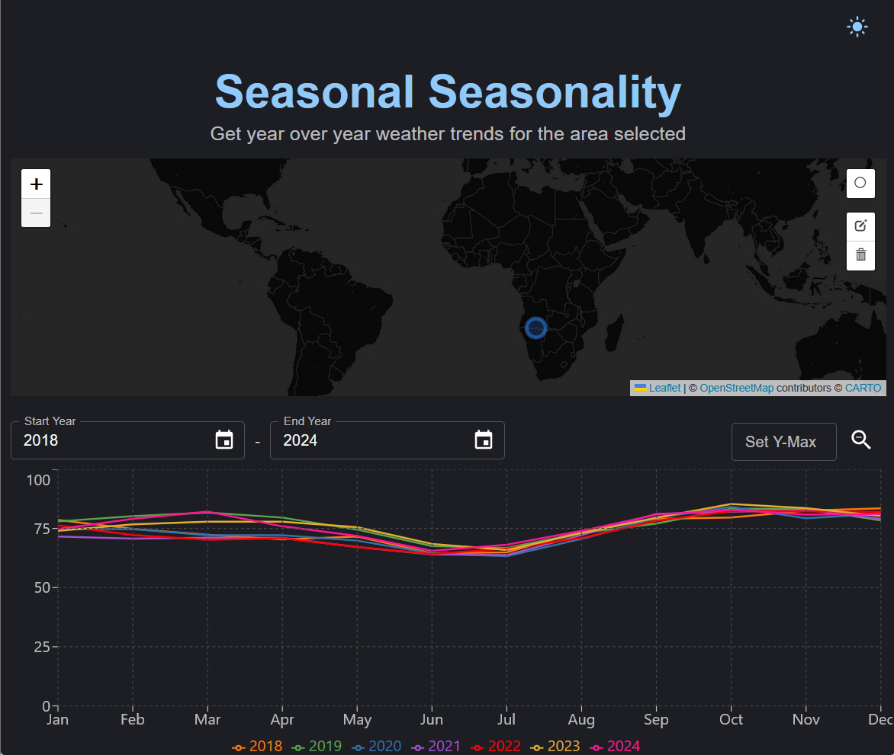
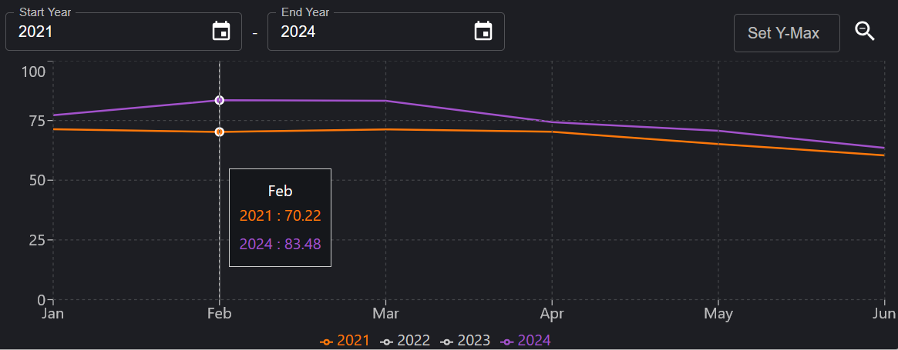
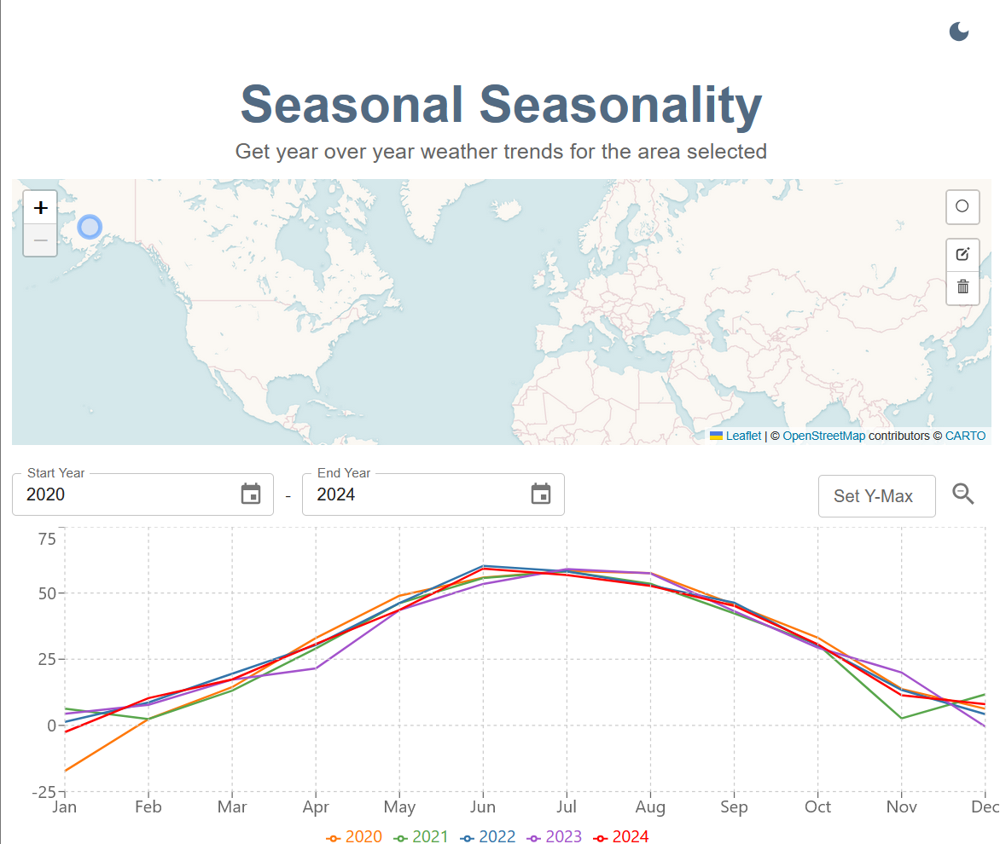

# Seasonal Seasonality
Dynamically generated seasonality chart based on location marked on an interactive map and dates selected.

React web application using the VITE build tool, Leaflet map with OpenStreetMap tilelayer, ReCharts for the seasonality graph, and Open-Mateo for historical weather data.

Plot a point on the interactive map, select the date range, then get the seasonality graph for that locations mean temperature over the years. 

Using Open-Meteo's Historical Weather API - https://open-meteo.com/en/docs/historical-weather-api

## Other features

- Highlight area within graph to zoom into it! Then click the `Zoom Out` button on the top right to see the full graph again. 
- Click on items in the legend to toggle the line's visibility on the graph.
- Hover over a data point in the graph to see tooltip with values. 

- Theme toggle allows user to switch between light and dark mode. 

## Running the project locally
1. Clone the repo
1. Go into the project directory
1. run **npm install**
1. run **npm run local**
1. go to **http://localhost:3000/** on your browser
